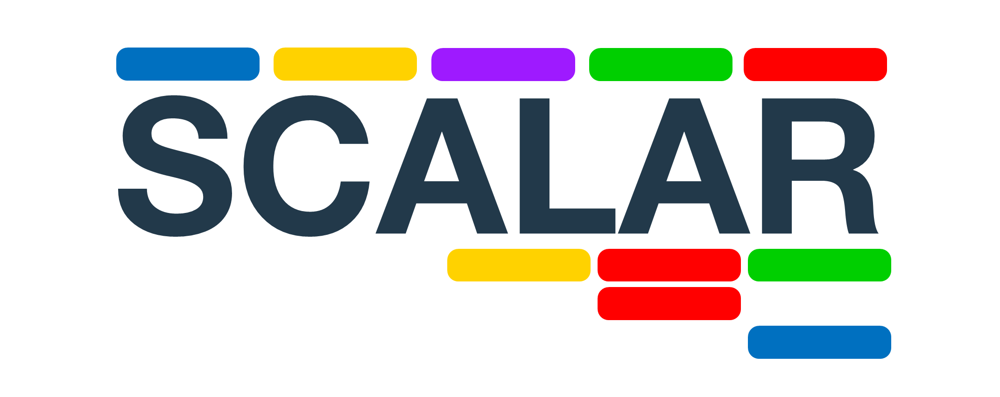
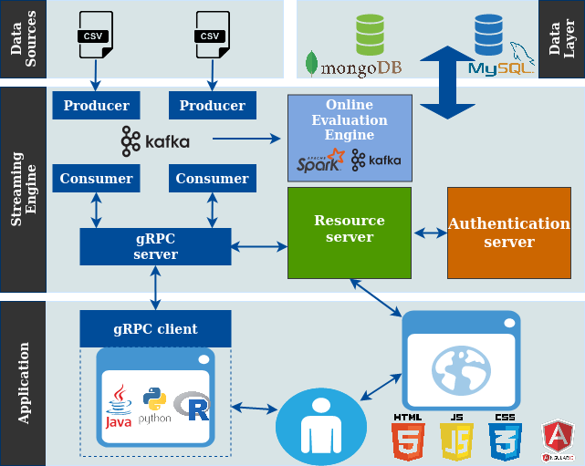

# SCALAR - Streaming ChALlenge plAtfoRm



SCALAR is the first of its kind, platform to organize Machine Learning competitions on Data Streams.
It was used to organize a real-time ML competition on IEEE Big Data Cup Challenges 2019.

## Features

**Data stream mining competitions** - With SCALAR you can organize the real-time competitions on Data Streams. 
It is inspired by [Kaggle](https://www.kaggle.com/), platform for offline machine learning competitions.


**Simple, user friendly interface** - SCALAR has a WEB application that allows you to easily browse and 
subscribe to the competitions. Its simple and intuitive design, let's you to easily upload the datasets, and create the 
competition. 


**Live results and leaderboard** - Since the competition is real-time, the results are also updated in real time. 
During the competition, you can follow performance of your model in the WEB application. Leaderboard will show how 
do you compare to other users, and live chart shows the comparison with baseline model.

**Secure, bi-directional streaming communication** - We use a combination of `gRPC` and `Protobuf` to provide secure, 
low latency bi-directional streaming communication between server and users.



**Freedom to choose a programming language** - SCALAR lets users to choose their preferred environment. The only 
requirement is to be able to communicate through `gRPC` and `Protobuf`, which is supported for many programming 
languages: Python, Java, C++, GO... Additionally, SCALAR provides support for R. Apart from that, users can choose 
their setup, environment and additional resources to train better models.

**** 

## Getting Started

The project is done in Python and organized in Docker containers.
Each service is a separate Docker container.

### Prerequisites

To run the platform locally, Docker is needed:

[Install Docker](https://docs.docker.com/get-docker/)

Also, Docker compose should be installed:

[Install Docker compose](https://docs.docker.com/compose/install/)

### Running

Running is done using Docker-compose.

 - Download the code locally and then adjust the [config.json](provider/my_application/config.json) and [docker-compose.yml](./docker-compose.yml) files. More details in [config-ReadMe.txt](provider/config-ReadMe.txt) and in [docker-compose-ReadMe.txt](./docker-compose-ReadMe.txt).

 - Set up an email account which will be used to send the registration confirmation message and authentication token.
For that, you will need to set up your email account to allow the access of less secure apps.
For a quick start, update only email information in [config.json](provider/my_application/config.json).

 - In [docker-compose.yml](./docker-compose.yml) update only the local paths to mount a persistent volumes, following the [docker-compose-ReadMe.txt](./docker-compose-ReadMe.txt).

 - To run the SCALAR application using Docker-compose, first create the Docker bridge network on your local machine:
```
docker network create --driver bridge provider_network --subnet=172.22.0.0/16 --ip-range=172.22.0.0/24 --gateway=172.22.0.1

```
You can choose the IP ranges according to your preferences.

 - Once the [config.json](provider/my_application/config.json) and [docker-compose.yml](./docker-compose.yml) have been set up and Docker network has been created,
  the platform can be run by:

```
docker-compose up
```

This command will pull all necessary containers and run them.
When all services are up, web application will be available on [localhost:80](http://localhost:80)

To log in to the platform, you can use default credentials: `admin:admin`
Default `Test` datastream, for creating the test competition is available under `Datastreams` tab.


To get to know around the platform use the the [Quick Start Guide](./SCALAR_Quick_Start_Guide.pdf). 
To create and participate in the competition use the provided [examples](./example_data).
* **Nedeljko Radulovic**
* **Dihia Boulegane**
* **Albert Bifet**
* **Nenad Stojanovic**


## Acknowledgments

Open source Docker containers were used:
* [MongoDB](https://hub.docker.com/_/mongo)
* [Spark Docker container by GettyImages](https://hub.docker.com/r/gettyimages/spark)
* [MySQL](https://hub.docker.com/_/mysql)
* [Kafka by Wurstmeister](https://hub.docker.com/r/wurstmeister/kafka)
* [Zookeeper by Wurstmeister](https://hub.docker.com/r/wurstmeister/zookeeper)

## References

* [Boulegane, Dihia, et al. "Real-Time Machine Learning Competition on Data Streams at the IEEE Big Data 2019." 2019 IEEE International Conference on Big Data (Big Data). IEEE, 2019.](https://ieeexplore.ieee.org/abstract/document/9006357?casa_token=f0mJeR8-WfYAAAAA:yEt_Mix9dumrPpo64uPBbI0XI4Kvfim4Pkg5xNVVzXqK4AGToX0XcJPKgETkE1hs86Pcc0u5xYc)
* [IEEE Big Data Cup 2019](https://bigmine.github.io/real-time-ML-competition/index.html)


